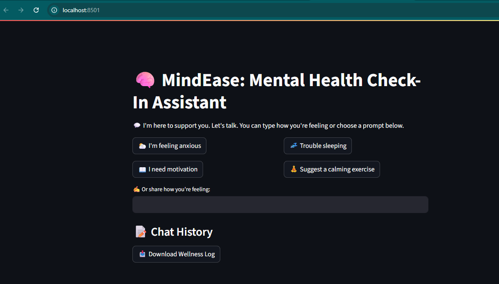

# 🧠 MindEase: Mental Health Check-In Assistant


MindEase is a local AI-powered mental wellness assistant that checks in with users, detects emotional tone, and responds empathetically with motivational quotes, calming techniques, or journaling prompts. Designed using **LangChain**, **Streamlit**, and **Ollama** (`gemma:2b`), it simulates a real-time emotional support conversation.

---

## 💡 Features

- 🧠 Emotion detection (anxiety, sadness, motivation, calm)
- 💬 Conversational memory using `ChatMessageHistory`
- 🌿 Calming suggestions: breathing, grounding, affirmations
- ✍️ Journaling and motivation prompts
- 🎨 Beautiful Streamlit UI with emoji-rich interaction
- 💾 Downloadable wellness log for journaling

---

## 🖼️ Screenshot




---

## 🛠️ Tech Stack

- **Python 3.9+**
- **Streamlit** – UI framework
- **LangChain** – LLM agent and memory handling
- **TextBlob** – Sentiment detection
- **Ollama (Gemma 2B)** – Local LLM runtime

---

## 🚀 How to Run This App Locally

### 🔹 Step 1: Clone or download this repo

```bash
git clone https://github.com/your-username/mental-health-ai-agent.git
cd mental-health-ai-agent
```

---

### 🔹 Step 2: Install required packages

```bash
pip install streamlit langchain langchain-core langchain-community textblob
python -m textblob.download_corpora
```

---

### 🔹 Step 3: Pull and Run Ollama model

Download and run the lightweight model for this agent:

```bash
ollama pull gemma:2b
ollama run gemma:2b
```

> Keep this terminal window open — Ollama must be active.

---

### 🔹 Step 4: Launch the Streamlit App

```bash
streamlit run mental_health_ai.py
```

Then open [http://localhost:8501](http://localhost:8501) in your browser.

---

## 📝 Project Structure

```
mental-health-ai-agent/
│
├── mental_health_ai.py       # Main Streamlit app
├── README.md                 # Project documentation
├── Screenshot-Homepage.png   # Optional: UI screenshot
└── requirements.txt          # (optional) Dependency list
```

---

## 📄 Assignment Notes

This app was built as part of a **GenAI AI Agent Development Assignment**, following a 4-layer agent architecture:
1. Input Understanding  
2. State Tracker  
3. Task Planner  
4. Output Generator  

Also includes:
- Reflection logs
- Prompt evolution journal
- Output testing
- Hack value add-ons (e.g., sentiment detection, local LLMs)

---

## 🙋 Author

**Meghana Jaggi**  
Email: jaggimeghana2124@gmail.com  
GitHub: [@Meghana-2124](https://github.com/Meghana-2124)

---

## 📦 License

This project is open-source and educational. Feel free to explore, adapt, or expand responsibly.

